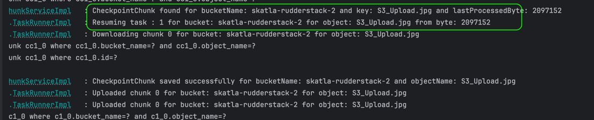

# Data Sync Scheduler

## High level design

## Schema for checkpoint

## Schema for checkpoint chunk (range downloads)

## Example:

### Difference checked and skipped already synched files

### Resuming sync from last successful checkpoint
